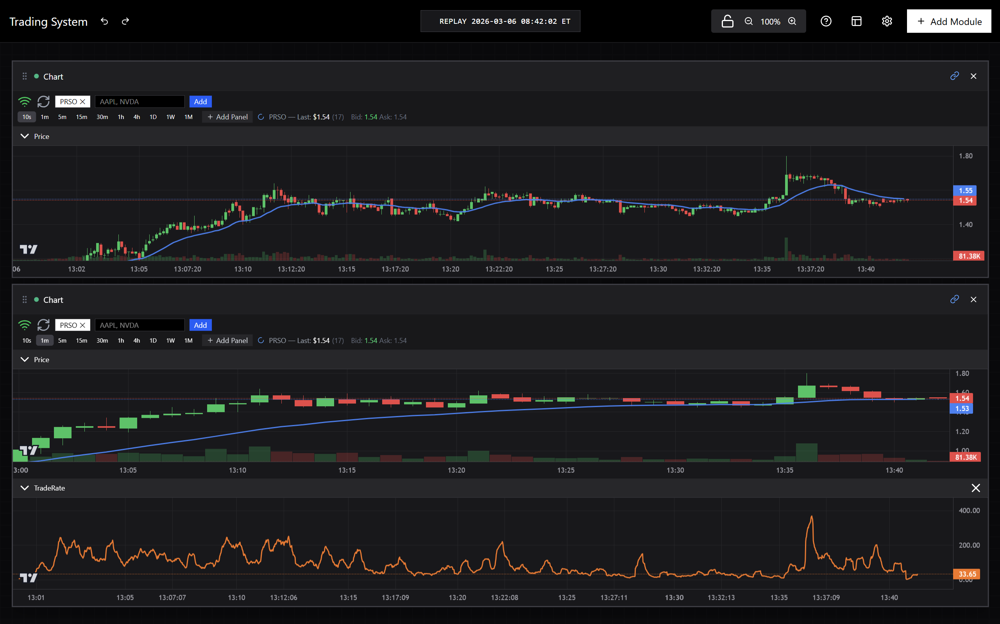

# Introduction

this file has my trading system module summary and the roadmap from very early experimental stage to planned.

### frontend preview

#### Overview layout Set

<p align="center">
  
  <br><em>Portfolio, order history and chart are using mock data</em>
</p>

#### Trade layout Set

<p align="center">
  
</p>

#### real-time Bar&Factor chart modules preview

<p align="center">
  
</p>

>You can customize your layout in setting.

Architecture in [ARCHITECTURE.md](ARCHITECTURE.md)

Detailed Document in [Jerry_Trader.pdf](docs/jerry_trader.pdf) (not refactored yet.)

Roadmap in [ROADMAP.md](ROADMAP.md)

Changelod in [CHANGELOG.md](CHANGELOG.md)

I use my self-built human agent task management system [Topology](https://github.com/JerryHong08/topology) to develop this project.

## Key Features

### Real-time Market Data Pipeline
- multi-source tick data ingestion (Polygon, Theta Data, local replay)
- rust-based BarBuilder with watermark close and late-arrival handling
- clickHouse storage for bars and factor snapshots

### Replay System
- distributed clock synchronization across machines
- historical tick-by-tick replay with configurable speed
- cross-machine time accuracy via Redis heartbeat

### Frontend  Visualization
- market cross-section snapshot: Rank list, overview chart
- stock detail: stock info, stock news
- order: order placement, historical orders, portfolio
- chart: Real-time bar chart, factor chart via WebSocket streaming

### Strategy-based Backtest Pipeline

## Installation & Quick Start

This project is designed for a multi-machine setup connected via a local network or [Tailscale](https://tailscale.com/). Each machine's role is defined in [`config.yaml`](/config.yaml.example).

### 1. Clone & Configure

```bash
git clone https://github.com/JerryHong08/jerry_trader.git && cd jerry_trader
```

#### 1.1 `basic_config.yaml`

| Key | Description |
|-----|-------------|
| `data.data_dir` | Local path where market data (Parquet files) is stored |

#### 1.2 `.env`

At minimum you need:

| Variable | Purpose |
|----------|---------|
| `POLYGON_API_KEY` | Polygon.io Advanced subscription (real-time snapshot + tick data) |
| `DATABASE_URL` | PostgreSQL connection string (order and news data persistence) |
| `CLICKHOUSE_PASSWORD` | Clickhouse authentication (snapshot, bars_builder,factor engine...) |
| `IB_PORT` | `7496` (TWS paper) / `7497` (TWS live) / `4002` (Gateway paper) / `4001` (Gateway live) |

> For the IB API client library, see [Download the TWS API](https://www.interactivebrokers.com/campus/ibkr-api-page/twsapi-doc/#find-the-api).

#### 1.3 `config.yaml` — Machine Roles

The system has multiple services that can be distributed across machines. my setup uses 3:

| Machine | Services |
|---------|----------|
| **A** | TickData Engine, BarBuilder, Factor Engine, AI Rule Engine, Order Execution |
| **B** | Market Snapshot engine (collect/replay), strategy-driving pre-processing(top20, normalization) |
| **C** | News Module (fetch, LLM classification), Agent BFF, Agent Reasoner |

See [`config.yaml.example`](/config.yaml.example) for the full schema and role definitions.

I recommend at least 2 machines, and highly recommend separate order execution and tickdata process with other parts.

### 2. Install Python Dependencies

```bash
# Create virtualenv and install all deps
poetry install

# Verify
poetry env info
```

### 3. Build the Rust Extension

```bash
# before run maturin, make sure you have cargo installed,
# if not, run below command then restarted the shell.
curl --proto '=https' --tlsv1.2 -sSf https://sh.rustup.rs | sh

# Build and install the Rust extension into the Poetry venv
poetry run maturin develop

# Verify
poetry run python -c "from jerry_trader._rust import sum_as_string; print(sum_as_string(1, 2))"
# → 3
```

For release-optimized builds: `poetry run maturin develop --release`

### 4. Database Setup

```bash
# Run Alembic migrations (requires postgres URL in alembic.ini)
poetry run alembic upgrade head
```

Make sure Redis is running (`redis-server` or via Docker).

### 5. Start the Backend

```bash
# Start all backend services for a machine profile defined in config.yaml
poetry run python -m jerry_trader.runtime.backend_starter --machine wsl2

# Dry-run to see what would start
poetry run python -m jerry_trader.runtime.backend_starter --machine wsl2 --dry-run

# With replay mode (historical date)
poetry run python -m jerry_trader.runtime.backend_starter --machine wsl2 --defaults.replay_date 20260115

# ibkr order management backend
uvicorn python.src.jerry_trader.apps.order_runtime.main:app --reload --port 8888
```

### 6. Start the Frontend

```bash
cd frontend
pnpm install
pnpm dev
```

### 7. Development Workflow

```bash
# After editing Rust code
poetry run maturin develop

# After editing Python code — no rebuild needed (editable install)

# Run tests
poetry run pytest

# Code formatting
poetry run black python/
poetry run isort python/
```

## Data Flow

### Live Mode (Machine A) — Bootstrap Coordinator V2

```
            Theta Data/Polygon/LocalSimulator tickdata WebSocket
                                    │
                                    ▼
                              UnifiedTickManager
                    ┌───────────────┼───────────────────┐
                 fan-out         fan-out              fan-out
                    │               │                    │
                    ▼               ▼                    ▼
            BarsBuilderService  FactorEngine          ChartBFF
         (Single Bar Truth)    (Indicators)        (Orchestration)
                    │               │                    │
                    │    ┌──────────┴──────────┐         │
                    │    │                     │         │
                    ▼    ▼                     ▼         ▼
              ClickHouse      BootstrapCoordinator  WebSocket + REST
             (OHLCV bars)      (orchestrates bars    (Frontend)
                    │           & factor warmup)      │
                    │                   ▲             │
                    │   ┌───────────────┘             │
                    │   │                             │
                    ▼   │                             │
              Redis pub/sub                           │
           ┌─────────────────┐                        │
           │ bars:{sym}:{tf} │────────────────────────┤
           │ factors:{sym}   │────────────────────────┘
           └─────────────────┘
```

**Bootstrap Flow:**
1. Frontend subscribes to ticker via ChartBFF WebSocket
2. ChartBFF calls `coordinator.start_bootstrap(symbol, timeframes)`
3. Coordinator calls `BarsBuilderService.add_ticker()` and `FactorEngine.add_ticker()` directly
4. BarsBuilder fetches trades → builds bars → stores in ClickHouse → notifies coordinator
5. FactorEngine waits for bars → warms up indicators → notifies coordinator
6. Coordinator signals "ready" → ChartBFF serves bars + factors to frontend

**Key Design:** No Redis Streams for bootstrap coordination — direct method calls via `BootstrapableService` protocol for reliability.

### Live Mode (Machine B)

```bash
Polygon REST (snapshot)
      │
      ▼
MarketsnapshotCollector ──► Redis B (raw snapshot)
                                  │
                                  ▼
                         SnapshotProcessor (Rust VolumeTracker)
                                  │
                     ┌────────────┴────────────┐
                     ▼                         ▼
              ClickHouse (snapshot)      Redis B (processed)
                                               │
                                               ▼
                                       JerryTraderBFF ──► Frontend
```

### Replay Mode

```bash
Parquet Lake (Machine A)
      │
      ▼
TickDataReplayer (Rust)          ReplayClock (Rust)
      │                                │
      │                                └──► Redis A heartbeat (100ms)
      ▼                                            │
UnifiedTickManager                                 ▼
   (SyncedReplayerManager)               Machine B: RemoteClockFollower
      │                                            │
      └──► same as live from here ──►    MarketSnapshotReplayer
```

### News Pipeline (Machine C)

```bash
NewsWorker (poll: momo/benzinga/fmp)
      │
      ▼
Redis B (raw news queue)  ──► Postgres (articles)
      │
      ▼
NewsProcessor (LLM: DeepSeek / Kimi)
      │
      ▼
Postgres (classified results)  ──► Redis B (news events)
      │
      ▼
AgentBFF ──► Frontend / [Stage4] AgentRuntime
```

### AI Agent Layer (planned)

```bash
Factor Engine / News Pipeline
      │
      ▼
┌─────────────────────────────────────────┐
│ Layer 1: Rule Engine (always-on)        │
│                                         │
│ Strategy DSL Rules (backtest optimized) │
│ ├─ Factor threshold triggers            │
│ ├─ News classifier triggers             │
│ └─ IF condition THEN activate           │
│                                         │
└─────────────────────────────────────────┘
                  ↓ Activation Event
                  ↓ {rule_id, symbol, context}
┌─────────────────────────────────────────┐
│ Layer 2: Agent Think (on-demand)        │
│                                         │
│ 1. Context Aggregator                   │
│    └─ Gather factors, news, trades      │
│                                         │
│ 2. LLM Reasoning                        │
│    └─ Per-rule prompt template          │
│    └─ Deep analysis → action            │
│                                         │
└─────────────────────────────────────────┘
                  ↓
┌─────────────────────────────────────────┐
│ Layer 3: Action                         │
│                                         │
│ ├─ Notify (Telegram/Discord/Webhook)    │
│ ├─ Generate Widget                      │
│ └─ Trigger downstream rule              │
│                                         │
└─────────────────────────────────────────┘

Offline: Backtest Engine
├─ Optimize rule thresholds
├─ Validate prompt templates
└─ Simulate agent decisions
```
