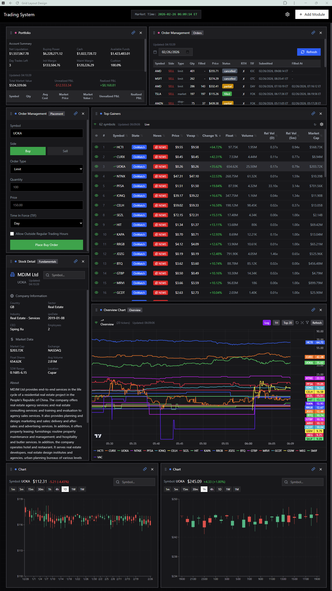
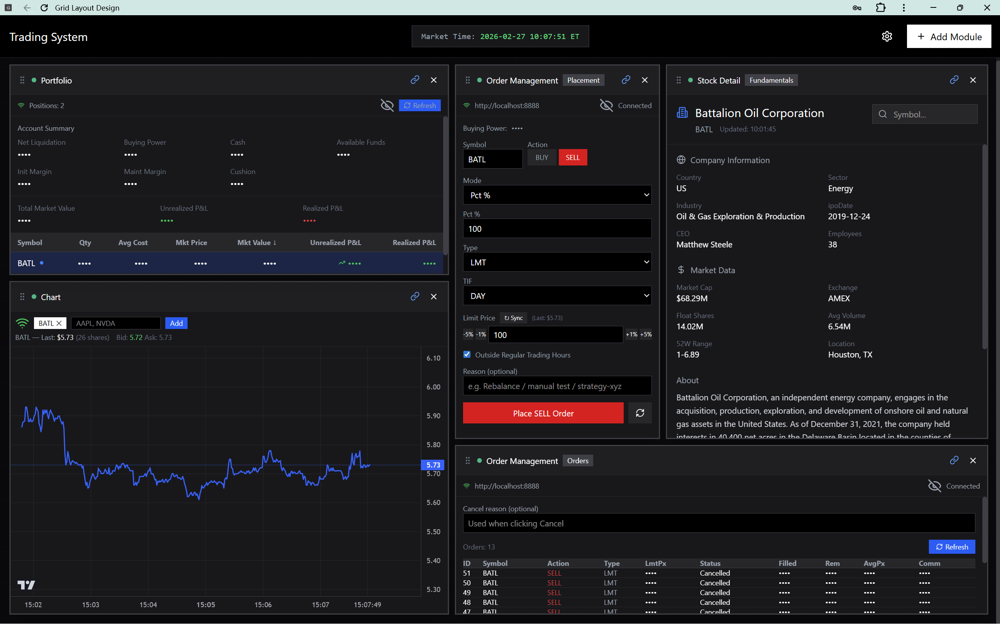
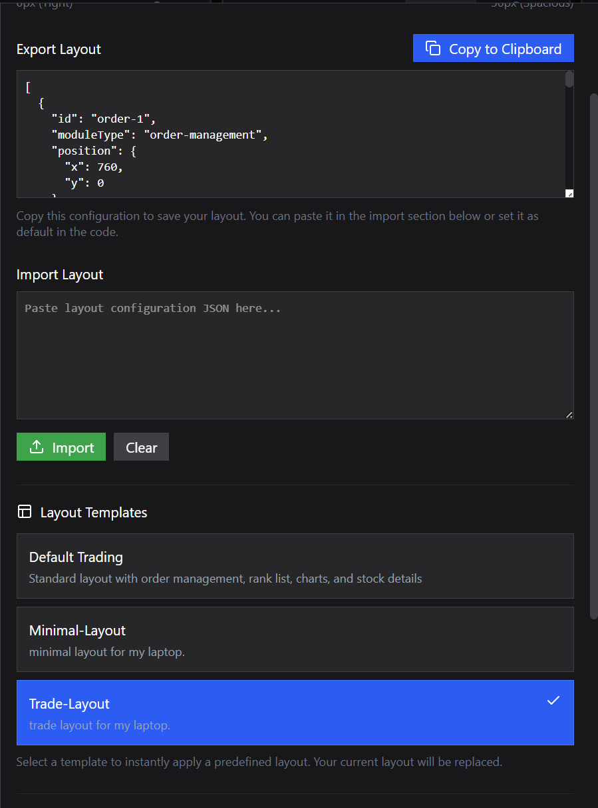

# Introduction

this file has my trading system module summary and the roadmap from very early experimental stage to planned.

## Installation & Quick Start

this project is built for my multiple machines working under the same network or through tailscale. you can configure each machine's role in the through [config.yaml](/config.yaml.example)

### 1. Clone & Configure

```bash
git clone <repo-url> jerry_trader && cd jerry_trader

Edit `.env` — at minimum you need:

- `POLYGON_API_KEY` — Polygon.io Advanced subscription (real-time snapshot + tick data)
- Database URLs for PostgreSQL / InfluxDB (if using persistence)
- `IB_PORT` — 7496 (paper) or 7497 (live) for IBKR TWS; 4002/4001 for Gateway

Edit `basic_config.yaml`:

- `data.data_dir` — local path where market data is stored

### 2. Install Python Dependencies

```bash
# Create virtualenv and install all deps
poetry install

# Verify
poetry env info
```

for ibapi installation, see [Download the TWS API](https://www.interactivebrokers.com/campus/ibkr-api-page/twsapi-doc/#find-the-api)

### 3. Build the Rust Extension

```bash
# Build and install the Rust extension into the Poetry venv
poetry run maturin develop

# Verify
poetry run python -c "from jerry_trader._rust import sum_as_string; print(sum_as_string(1, 2))"
# → 3
```

For release-optimized builds: `poetry run maturin develop --release`

### 4. Database Setup

```bash
# Run Alembic migrations (requires postgres URL in alembic.ini)
poetry run alembic upgrade head
```

Make sure Redis is running (`redis-server` or via Docker).

### 5. Start the Backend

```bash
# Start all backend services for a machine profile defined in config.yaml
poetry run python -m jerry_trader.backend_starter --machine wsl2

# Dry-run to see what would start
poetry run python -m jerry_trader.backend_starter --machine wsl2 --dry-run

# With replay mode (historical date)
poetry run python -m jerry_trader.backend_starter --machine wsl2 --defaults.replay_date 20260115
```

### 6. Start the Frontend

```bash
cd frontend
pnpm install
pnpm dev
```

### 7. Development Workflow

```bash
# After editing Rust code
poetry run maturin develop

# After editing Python code — no rebuild needed (editable install)

# Run tests
poetry run pytest

# Code formatting
poetry run black python/
poetry run isort python/
```

## roadmap

### Stage 1 & Initial Start

mainly focus on basic function test and expriment.

✅IBKR Order Placement & Realtime Order Book Web App (Python + React)

- ✅React frontend + backend
  - websocket backend server
  - websocket backend debug server
  - single ticker real-time quote
  - multi ticker real-time quote
  - add trades
- ✅IBKR Order Placement Engine
  - IBKR Gateway/TWS connect & starter(using `/opt/ibc/gatewaystart.sh`). now moved to use windows gateway for wsl mirrored network mode.
  - Basic IB Classes like Contract, Order...

### Stage2(Current)

mainly focus on basic modules development and strcuture buidling.

- ✅using figma make frontend code package.
  this frontend layout of trading system is gird layout, and each grid/module is seperated for easy to develop and customize.
  - Top Gainers/Rank List
  - Overview Chart
  - Order Management
  - Stock Detail
  - Portfolio
  - Chart

- migrate the backend data source to the frontend replacing the mock data.
  - ✅start with building a backend for frontend(bff), then migrate data step by step.
  - first start with the Top Gainers column data.
    - ✅first we test with basic direct emit columns like ['symbol', 'rank', 'price', 'change', 'changePercent', 'volume', 'relativeVolume5min', 'relativeVolumeDaily'].
    - ✅then we test the state column
    - ✅then we test the passively fetched and emitted columns like ['float_share','marketCap','news'].
  - ✅after that or during test of column data, we can test the overviewchartdata emit, which needs to normalize the frontend chart and get_chart_data in overviewchartdataManager.py.
  - ✅then Stock Detail. the data request is driven by top gainers and backend data management, so it should use cache, and also the data request can be driven by the frontend button. it's basic the same as the static data column update in top gainers column.
  - ✅then the Portfolio and Order Management. this module is isolated, so it's easier to integrate.

### Stage2.5(Current)

📌the last one is the Chart module, based on tradingview lightweight chart, the focus is balance between the real-time update and historical data retrival. **data management and historical data bootstrap. also build a architecture prepared for stage3 strategy real-time/replay computation, execution, analysis**

- bootstrap using api&cache
- write a data pipeline in Rust
  - current architecture:

    ``` bash
    v1.0

    frontend
      -> request - bff for historical data api fetch(cache&incremental design)
      -> subscribe - tickdataServer for real-time websocket

    problem:
      bar consistency issues
      UI complexity
      duplicate aggregation logic
      hard to scale
    ```

  - planned architecture(for better tradingng ui):

    ``` bash
    v2.0

    frontend
      -> request - bars builder for historical data api fetch(The builder maintains rolling bar states.)
      -> subscribe - bars builder for real-time websocket

    Backend pipeline:
      polygon ticks
          │
          ▼
      tick ingestion
          │
          ▼
      Bar Builder Service
          │
          ├─ maintains rolling bar states
          │
          ├─ persists completed bars
          │
          └─ streams realtime bar updates

    Frontend behavior:
      getBars()
      subscribeBars()

    Advantages:
      UI becomes simple
      bar consistency guaranteed
      deterministic bar generation
      lower websocket bandwidth
    ```

  - planned architecture(for better quant strategy computation&execution):

    ``` bash
    v3.0

    market feed
      │
      ▼
    tick ingestion
      │
      ▼
    stream bus
      │
      ├─ bar builder
      ├─ feature engine
      └─ strategy engine

    more to be discussed yet.

    ```

- restructure and introduce rust

#### Stage 2.5 TODO

Phase 1 — Rust BarBuilder core (`rust/src/bars.rs`)

- [x] `BarState` struct (open/high/low/close/volume/trade_count/vwap/bar_start/session)
- [x] `Timeframe` enum (10s, 1m, 5m, 15m, 1h, 4h, 1d, 1w)
- [x] `SessionCalendar` — US session boundaries (premarket 4:00, regular 9:30, afterhours 16:00–20:00)
- [x] `BarBuilder` as `#[pyclass]` — maintains per-ticker, per-timeframe rolling state
- [x] `ingest_trade(ticker, price, size, timestamp_ms)` → returns completed bars
- [x] `get_current_bar(ticker, timeframe)` → returns partial bar
- [x] `flush()` → force-complete all open bars
- [x] Session-aware bar boundary truncation
- [x] Rust unit tests
- [x] `maturin develop --release`, verify import from Python

Phase 2 — ClickHouse + Python BarsBuilderService

- [x] ClickHouse `ohlcv_bars` table schema (ReplacingMergeTree, partitioned by date)
- [x] Python ClickHouse client integration (clickhouse-connect)
- [x] `BarsBuilderService` (Python): tick ingestion → Rust BarBuilder → ClickHouse write → Redis pub/sub
- [x] Add `BarsBuilder` role to config.yaml machine profiles
- [x] Register BarsBuilder in backend_starter.py
- [ ] Historical bar bootstrap from Polygon API → ClickHouse backfill

Phase 3 — Frontend integration

- [x] REST endpoint: BFF queries ClickHouse for BarBuilder timeframes, falls back to ChartDataService
- [x] WebSocket relay: BFF subscribes to Redis `bars:*` pub/sub, relays `bar_update` to clients
- [x] `subscribe_bars` / `unsubscribe_bars` WS message types
- [x] `chartDataStore.ts`: added `applyBarUpdate()` for server-pushed completed bars
- [x] `useWebSocket.ts`: handles `bar_update` message, exports `subscribeBarUpdates()`
- [x] `ChartModule.tsx`: subscribes on mount, unsubscribes on cleanup, added `10s` timeframe
- [x] `ChartTimeframe` type: added `10s`
- [ ] Remove frontend-side `updateFromTrade()` aggregation (kept as fallback for now)

Phase 4 — Downstream consumers + InfluxDB→ClickHouse migration

- [ ] FactorEngine consumes completed bars (not raw ticks)
- [ ] Factor output: InfluxDB → ClickHouse
- [ ] Factor visualization overlay in Chart module
- [ ] Snapshot data: InfluxDB → ClickHouse
- [ ] Foundation for v3.0 stream bus architecture

### Stage3

mainly focus on strategy computation,execution,replay backtest.

- ✅separated works to other computuers using ssh. configured in config.yaml.
- visualization of factors in chart module.
- real-time risk management engine/trigger.
  - risk manage rule
- developing machine learning module.
  - build breakout-compute-analyze oriented Context Model using current recored files.
  - simulate market_snapshot replay using historical trade&quote bulk file.
  - build historical context model.
- rewrite stateEngine in rust.
- rewrite factorEegine in Rust.

### optional features

some other features to make it better.

- historical orders analysis modules.
- Add more modules, like Agent module to monitor the global staus also focus on one ticker at the same time.
- news room

### Current frontend preview

#### Overview Layout Set

<p align="center">
  
  <br><em>Portfolio, order history and chart are using mock data</em>
</p>

#### Trade Layout Set

<p align="center">
  
</p>

#### Layout Setting

<p align="center">
  
  <br><em>Import, load and customize your layout in the setting panel</em>
</p>
